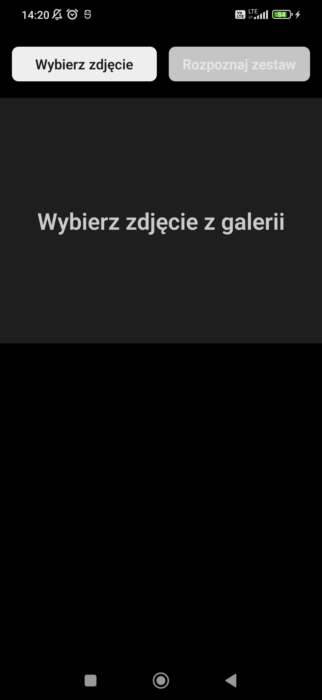
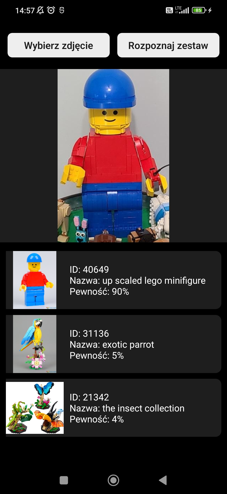

# Author

Mateusz Matkowski

# About

This is a [**React Native**](https://reactnative.dev) project for LEGO sets classification created for my Master Thesis. It is using a TensorFlow Lite model with the help of [react-native-fast-tflite](https://github.com/mrousavy/react-native-fast-tflite) library. It can predict 50 different LEGO sets with the validation accuracy of 96%. After choosing an image from the galery (left button) and clicking the right button it returns up to 5 most similar sets to the input image.  

Project bootstrapped using [`@react-native-community/cli`](https://github.com/react-native-community/cli).

## Screenshots from the app


Empty page:
<br>

<br>

Model results:
<br>

<br>

# Getting Started

>**Note**: Make sure you have completed the [React Native - Environment Setup](https://reactnative.dev/docs/environment-setup) instructions till "Creating a new application" step, before proceeding.

## Step 1: Start the Metro Server

First, you will need to start **Metro**, the JavaScript _bundler_ that ships _with_ React Native.

To start Metro, run the following command from the _root_ of your React Native project:

```bash
# using npm
npm start

# OR using Yarn
yarn start
```

## Step 2: Start your Application

Let Metro Bundler run in its _own_ terminal. Open a _new_ terminal from the _root_ of your React Native project. Run the following command to start your _Android_ or _iOS_ app:

### For Android

```bash
# using npm
npm run android

# OR using Yarn
yarn android
```

### For iOS

```bash
# using npm
npm run ios

# OR using Yarn
yarn ios
```

If everything is set up _correctly_, you should see your new app running in your _Android Emulator_ or _iOS Simulator_ shortly provided you have set up your emulator/simulator correctly.

This is one way to run your app — you can also run it directly from within Android Studio and Xcode respectively.

